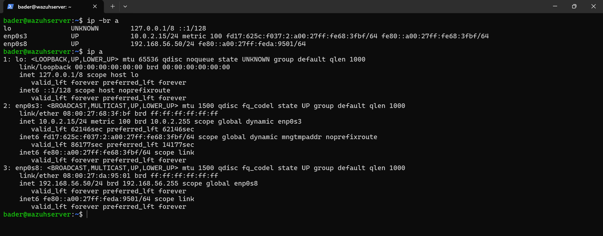
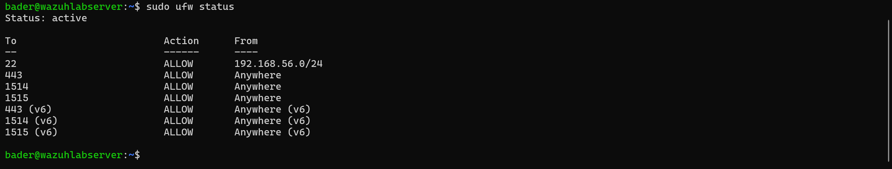
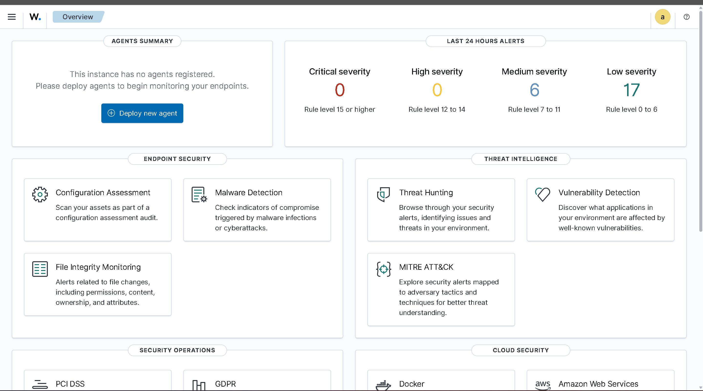
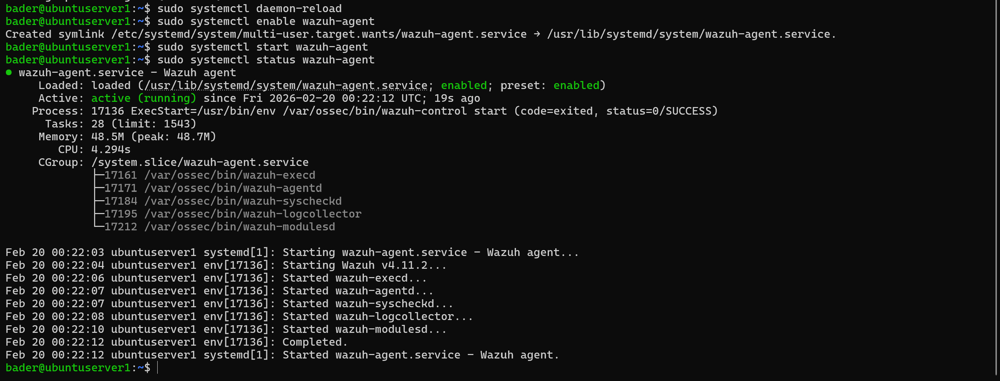
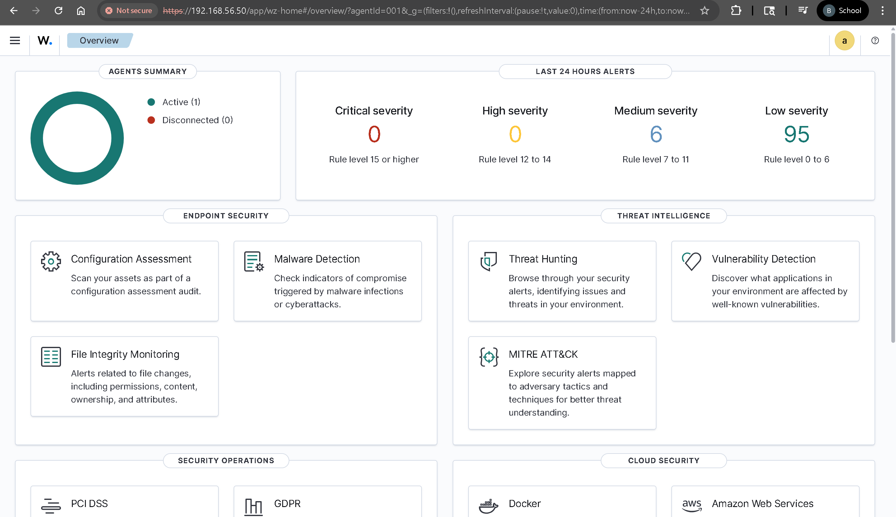
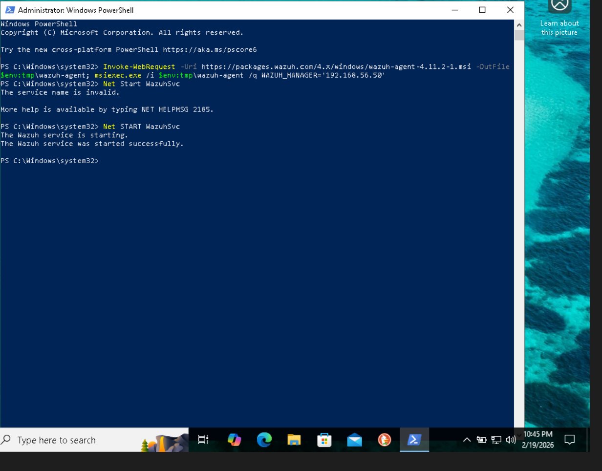
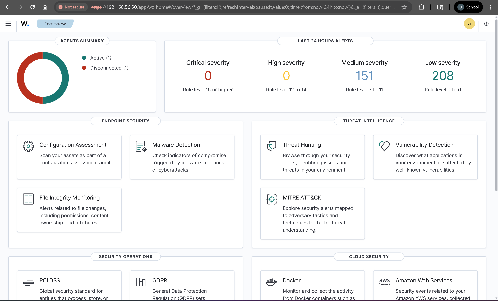

# Wazuh SIEM — Setup & Deployment

Installed Wazuh 4.11.2 (all-in-one) on an Ubuntu Server VM and deployed agents to monitor both Linux and Windows endpoints.

## Lab Environment

| VM | OS | Role | IP (Host-Only) |
|---|---|---|---|
| Ubuntu Wazuh Server | Ubuntu 24.04 LTS | Wazuh Manager + Indexer + Dashboard | 192.168.56.50 |
| Ubuntu Server | Ubuntu 24.04 LTS | Wazuh Agent (Linux endpoint) | 192.168.56.x |
| Windows Endpoint | Windows 10 | Wazuh Agent (Windows endpoint) | 192.168.56.x |

All VMs run on **VirtualBox** with two network adapters: **NAT** (internet) + **Host-Only** (internal lab communication).

## Wazuh Server Installation

Installed using the official all-in-one script, which sets up the indexer, manager, and dashboard on a single machine:

```bash
curl -sO https://packages.wazuh.com/4.11/wazuh-install.sh && sudo bash ./wazuh-install.sh -a
```

Confirmed networking on the server before proceeding:



## Firewall Configuration

Wazuh requires three ports open on the server. Configured UFW accordingly:

```bash
sudo ufw allow 443    # Dashboard (HTTPS)
sudo ufw allow 1514   # Agent communication
sudo ufw allow 1515   # Agent enrollment
```



## Dashboard Access

Accessed the Wazuh dashboard from the host machine at `https://192.168.56.50` using the credentials generated during installation.



## Agent Deployment

### Ubuntu Agent

Installed the Wazuh agent on the Ubuntu Server VM, pointed it to the manager, and started the service:

```bash
wget https://packages.wazuh.com/4.x/apt/pool/main/w/wazuh-agent/wazuh-agent_4.11.2-1_amd64.deb && sudo WAZUH_MANAGER='192.168.56.50' dpkg -i ./wazuh-agent_4.11.2-1_amd64.deb
sudo systemctl daemon-reload
sudo systemctl enable wazuh-agent
sudo systemctl start wazuh-agent
```



Dashboard confirmed the first agent reporting in — 1 active, alerts already generating:



### Windows Agent

Installed via PowerShell (as Administrator) on the Windows 10 VM:

```powershell
Invoke-WebRequest -Uri https://packages.wazuh.com/4.x/windows/wazuh-agent-4.11.2-1.msi -OutFile $env:tmp\wazuh-agent; msiexec.exe /i $env:tmp\wazuh-agent /q WAZUH_MANAGER='192.168.56.50'
NET START WazuhSvc
```



Dashboard now showing both agents — Windows immediately generated significantly more alerts than Linux:



## Troubleshooting

Two issues encountered during setup, both documented with root cause analysis and fixes:

| Issue | Summary |
|---|---|
| [LVM Disk Space Full](troubleshooting/lvm-disk-space.md) | Ubuntu Server's default LVM only allocated ~50% of the disk. Wazuh's indexer filled it completely, causing all services to fail. |
| [Indexer Boot Order](troubleshooting/indexer-boot-order.md) | All three Wazuh services started simultaneously on boot with no dependencies. The indexer consistently timed out, taking the manager and dashboard down with it. Fixed with systemd overrides. |
