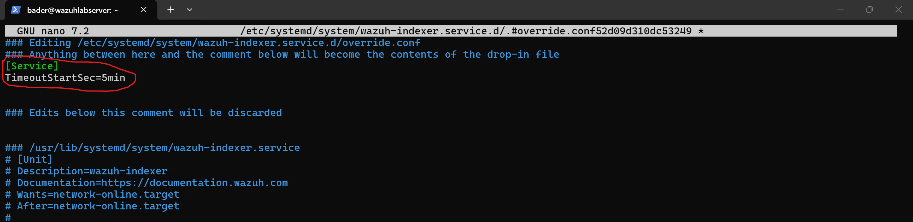
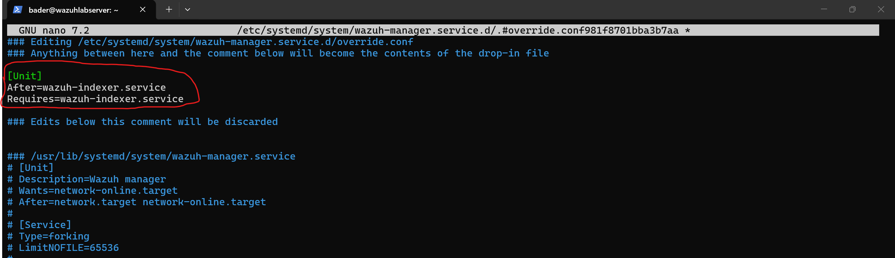
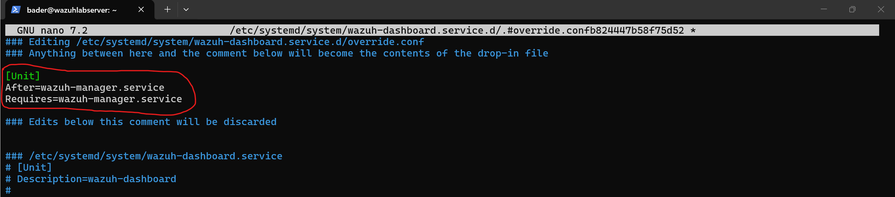

# Troubleshooting: Wazuh Indexer Timeout on Boot — Service Boot Order Fix

## Symptom

After every reboot, the Wazuh dashboard showed **"Wazuh dashboard server is not ready yet"**. The indexer consistently failed with a startup timeout, which cascaded and caused the manager and dashboard to fail as well.


Manually stopping all services and restarting them **in order** (indexer → manager → dashboard) always resolved it — confirming this was a boot timing issue, not a resource problem.

## Root Cause

Two problems:

**1. Startup timeout too short.** The wazuh-indexer (OpenSearch/Java-based) had a `TimeoutStartSec=3min` default. On a 4 GB RAM VM, the indexer's wall clock startup time was pushing right up against that 3-minute limit — some boots it made it, most it didn't.

**2. No service dependencies.** All three Wazuh services (`wazuh-indexer`, `wazuh-manager`, `wazuh-dashboard`) started simultaneously at boot. The manager and dashboard depend on the indexer being ready, but systemd didn't know that — so they'd race to start, compete for resources, and the indexer would lose.

## Fix

Created systemd override files to increase the timeout and enforce a sequential boot chain: **indexer → manager → dashboard**.

**Increase indexer timeout to 5 minutes:**

```bash
sudo systemctl edit wazuh-indexer
```

```ini
[Service]
TimeoutStartSec=5min
```



**Manager waits for indexer:**

```bash
sudo systemctl edit wazuh-manager
```

```ini
[Unit]
After=wazuh-indexer.service
Requires=wazuh-indexer.service
```



**Dashboard waits for manager:**

```bash
sudo systemctl edit wazuh-dashboard
```

```ini
[Unit]
After=wazuh-manager.service
Requires=wazuh-manager.service
```



**Apply changes:**

```bash
sudo systemctl daemon-reload
```

## Result

After reboot, all three services started cleanly in sequence with no manual intervention. The dashboard loaded on first attempt.

## Key Takeaway

Wazuh's all-in-one installer does not configure service dependencies between its own components. On resource-constrained VMs, the default 3-minute indexer timeout combined with all services racing to start simultaneously will cause consistent boot failures. Using `systemctl edit` to create override files is the clean way to fix this — it survives package updates since the overrides are separate from the original unit files.
