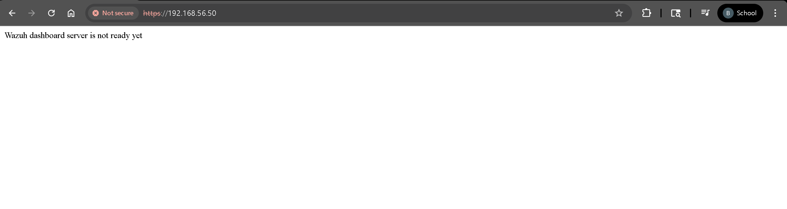
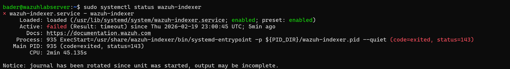
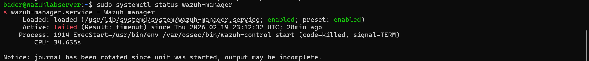
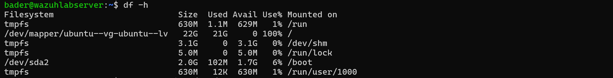
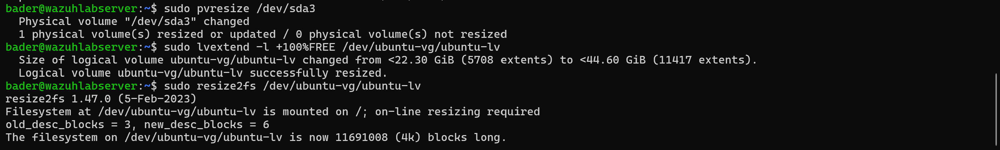
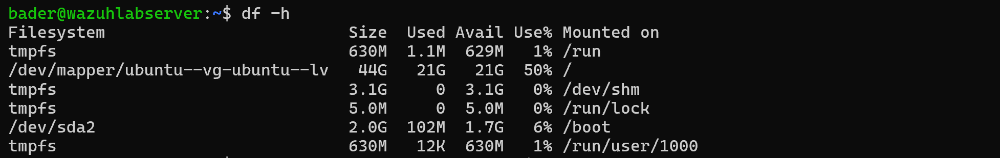

# Troubleshooting: LVM Disk Space Full — Wazuh Indexer Failure

## Symptom

After installing Wazuh, the dashboard showed **"Wazuh dashboard server is not ready yet"** and both the indexer and manager services failed to start.







## Root Cause

Ubuntu Server's default LVM installation only allocates **~50% of the available disk** to the root logical volume. On a 46 GB virtual disk, only 22 GB was assigned — and Wazuh's indexer (OpenSearch) consumed all of it.

`df -h` confirmed the root filesystem was at **100% usage** with 0 bytes available:



## Fix

Expanded the logical volume to use all remaining free space on the disk:

```bash
sudo pvresize /dev/sda3
sudo lvextend -l +100%FREE /dev/ubuntu-vg/ubuntu-lv
sudo resize2fs /dev/ubuntu-vg/ubuntu-lv
```



## Result

Root filesystem went from **100% → 50%** with 21 GB free. All Wazuh services started successfully after the expansion.



## Key Takeaway

Always verify disk allocation with `df -h` after a fresh Ubuntu Server install. The default LVM config does not use the full disk — this will silently break storage-heavy services like Wazuh's indexer.
