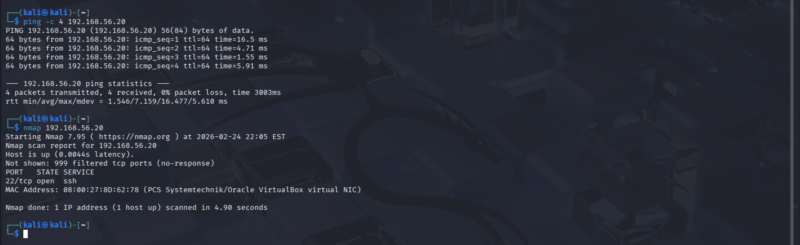
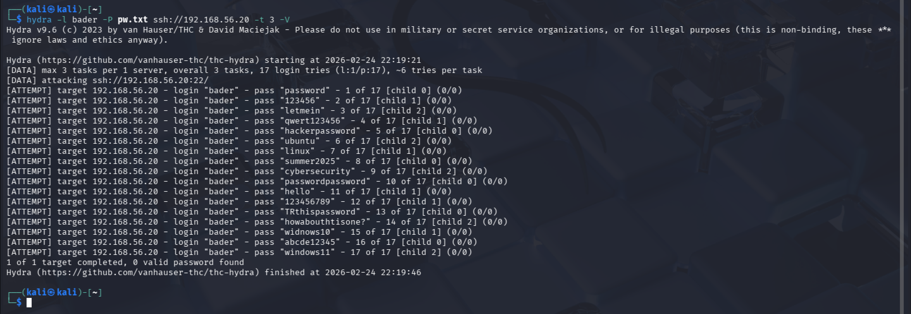
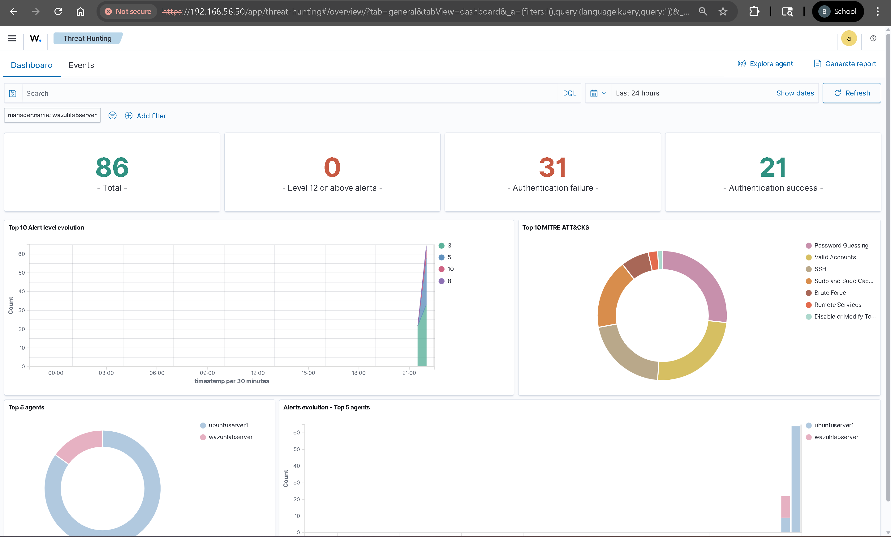
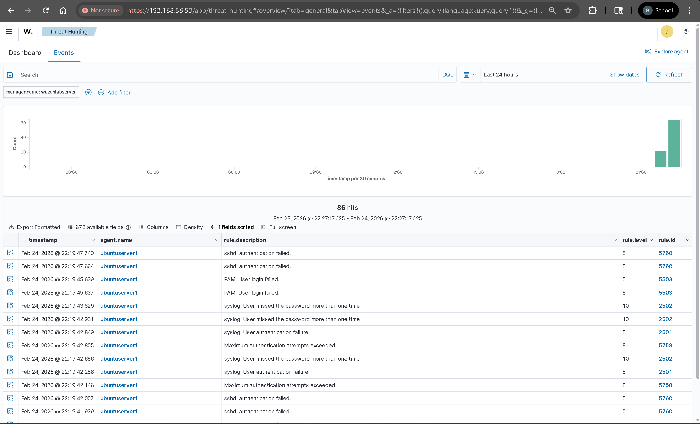
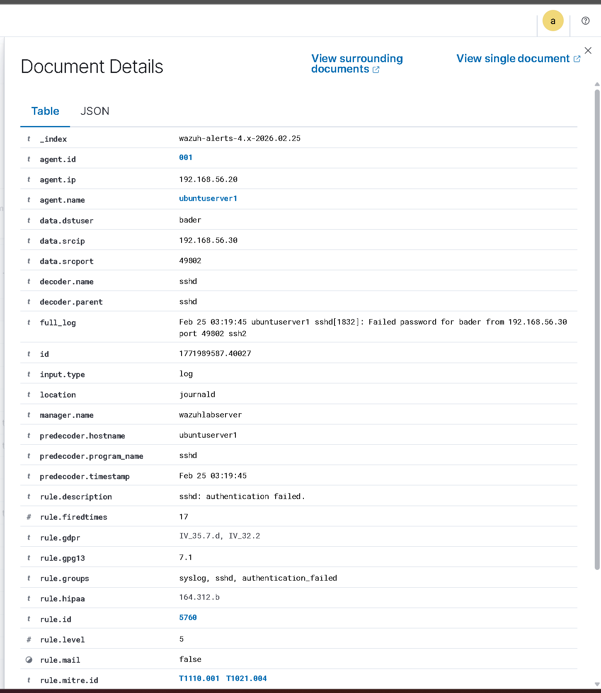
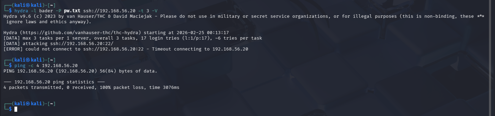
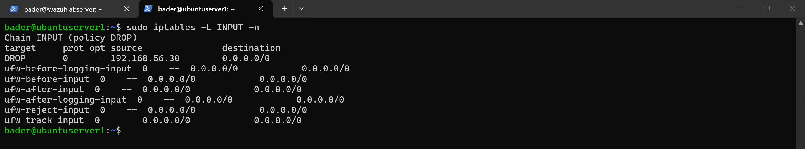
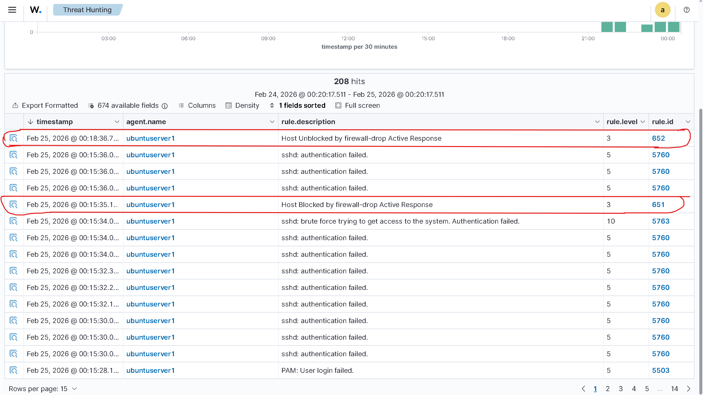

# SSH Brute Force — Detection & Active Response

Simulated an SSH brute force attack from Kali against a Wazuh-monitored Ubuntu endpoint. Wazuh detected the attack, mapped it to MITRE ATT&CK, and automatically blocked the attacker's IP through active response.

## Lab Environment

| VM | Role | IP |
|---|---|---|
| Kali | Attacker | 192.168.56.30 |
| Ubuntu Server | Target (Wazuh Agent) | 192.168.56.20 |
| Ubuntu Wazuh Server | SIEM Manager | 192.168.56.50 |

## Reconnaissance

Confirmed target connectivity and discovered SSH (port 22) open via Nmap:



## Attack — SSH Brute Force

Launched a dictionary attack using Hydra from Kali against the Ubuntu agent with a custom wordlist:

```bash
hydra -l bader -P pw.txt ssh://192.168.56.20 -t 3 -V
```

All 17 attempts failed — no valid password found:



## Detection — Wazuh Alert Analysis

Wazuh immediately detected the attack. The Threat Hunting dashboard showed 86 total alerts with 31 authentication failures and MITRE ATT&CK techniques mapped automatically:



The Events tab shows individual alerts with rule IDs — each failed login generated its own alert:



### Key Wazuh Rules Triggered

**Rule 5760** — Individual SSH authentication failure. Each failed Hydra attempt generated one of these. The alert details show the attacker's source IP (`192.168.56.30`), the targeted user (`bader`), the raw sshd log, and MITRE technique IDs `T1110.001` (Password Guessing) and `T1021.004` (SSH):



**Rule 5763** — SSH brute force detected. Wazuh correlated multiple failed attempts from the same source and triggered this level 10 alert. The `previous_output` field shows the chain of failed logins that led to the detection. MITRE mapping: `T1110` → Credential Access → Brute Force:


### MITRE ATT&CK Mapping

Wazuh's MITRE ATT&CK framework view shows all techniques triggered by the attack — Password Guessing (23 hits), SSH (18), Brute Force (6), with Credential Access as the top tactic:


## Active Response — Automated IP Block

Detection alone doesn't stop an attacker. Configured Wazuh's active response to automatically block the attacker's IP when rule 5763 (brute force) fires.

Added the following to `/var/ossec/etc/ossec.conf` on the Wazuh manager:

```xml
<active-response>
  <disabled>no</disabled>
  <command>firewall-drop</command>
  <location>local</location>
  <rules_id>5763</rules_id>
  <timeout>180</timeout>
</active-response>
```

This tells Wazuh: when brute force is detected, drop the source IP via iptables on the reporting agent for 180 seconds.


### Result

Re-ran Hydra after enabling active response. Wazuh detected the brute force, triggered the firewall-drop, and Kali was completely blocked — SSH connection timed out and even ping showed 100% packet loss:



Confirmed on the Ubuntu agent — Wazuh injected a DROP rule for `192.168.56.30` directly into iptables:



### Full Alert Lifecycle

The Wazuh dashboard captured the entire sequence: failed login alerts (5760) → brute force detection (5763) → **Host Blocked** by active response (651) → auto **Host Unblocked** after 180-second timeout (652):



## Why Wazuh Active Response Over Fail2Ban

Fail2Ban works — it was tested in this lab and successfully [banned the attacker's IP](screenshots/fail2ban-client-status-shows-banned-kali-ip.png) after 6 failed attempts. But it operates locally on each host. In an environment with 10, 50, or 100 servers, each one needs Fail2Ban independently configured and maintained.

Wazuh Active Response is centralized. The manager detects the attack from agent logs and pushes the block command back to the endpoint — or to *all* endpoints. One detection can trigger a response across the entire infrastructure. That's the difference between host-level protection and enterprise-level security orchestration.

| | Fail2Ban | Wazuh Active Response |
|---|---|---|
| Scope | Local (per host) | Centralized (all agents) |
| Configuration | Each server independently | Single manager config |
| Visibility | Local logs only | Full SIEM dashboard + MITRE mapping |
| Scalability | Manual per host | Scales with agent deployment |
