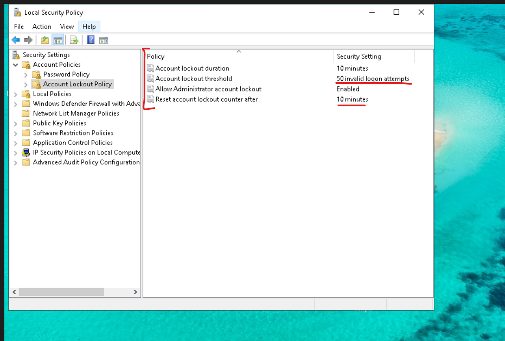
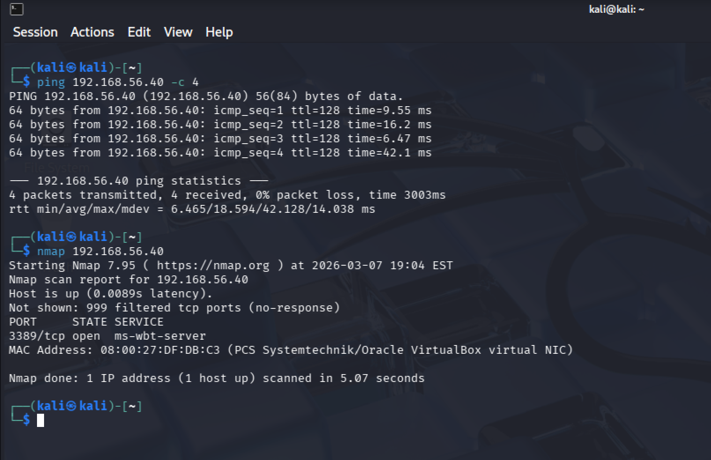
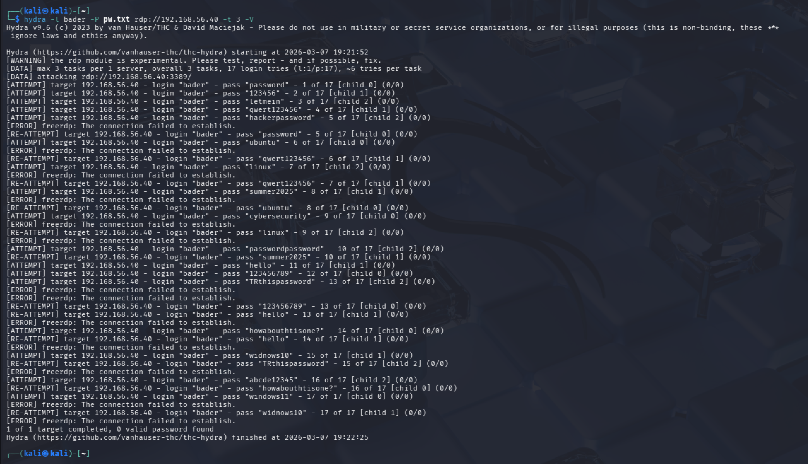
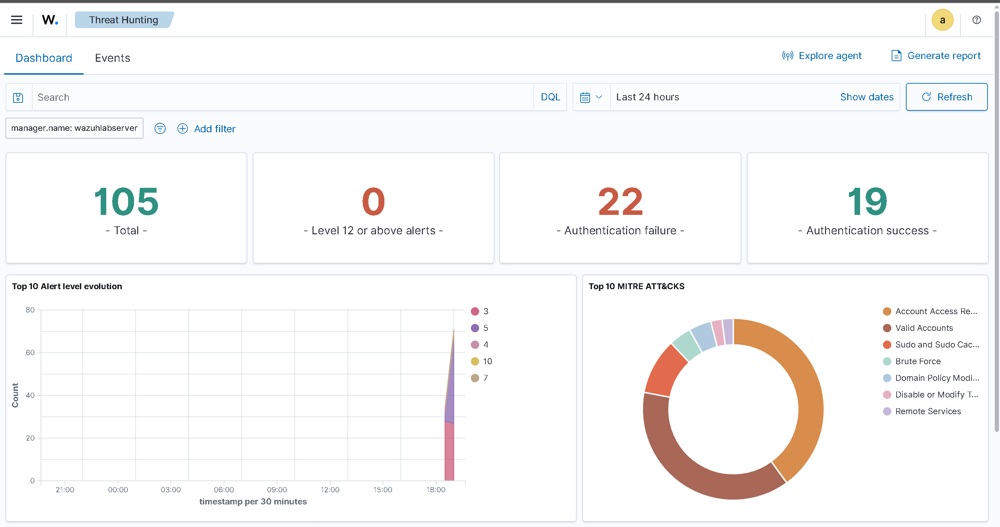
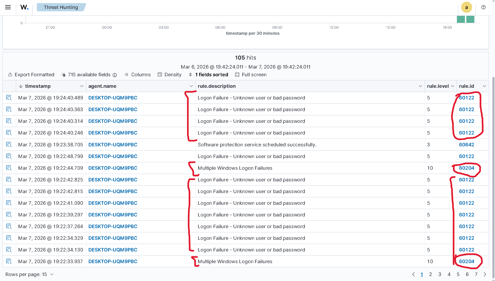
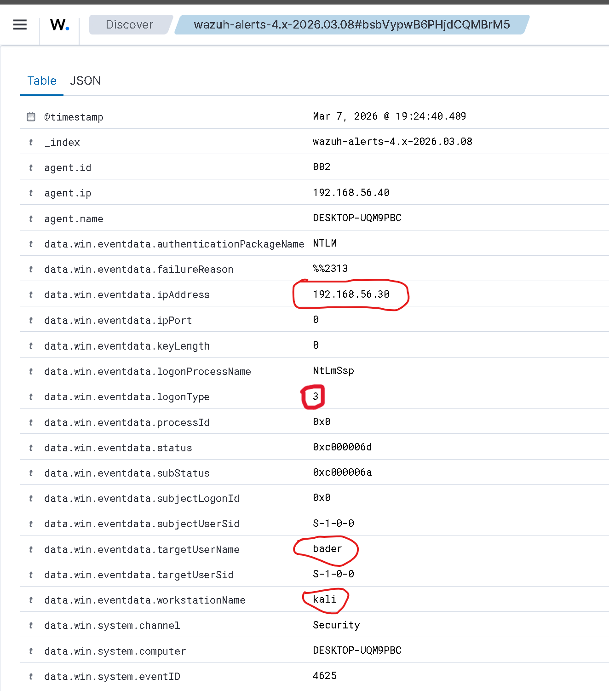
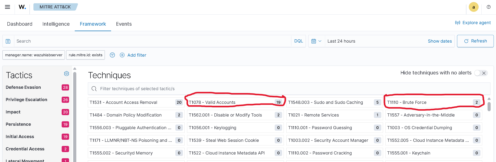

# RDP Brute Force — Detection & Analysis

Simulated an RDP brute force attack from Kali against a Wazuh-monitored Windows endpoint. Wazuh detected the attack through Windows Event Logs and mapped it to MITRE ATT&CK — demonstrating cross-platform detection alongside the [SSH brute force lab](../02-ssh-brute-force-detection/).

## Lab Environment

| VM | Role | IP |
|---|---|---|
| Kali | Attacker | 192.168.56.30 |
| Windows 10 | Target (Wazuh Agent) | 192.168.56.40 |
| Ubuntu Wazuh Server | SIEM Manager | 192.168.56.50 |

## Pre-Attack Setup

Verified the Windows Account Lockout Policy before attacking — the threshold was set to 50 invalid attempts, meaning our 17-attempt wordlist would not trigger a lockout:



## Reconnaissance

Confirmed connectivity and discovered RDP (port 3389) open via Nmap:



## Attack — RDP Brute Force

Launched a dictionary attack using Hydra from Kali targeting RDP on the Windows endpoint:

```bash
hydra -l bader -P pw.txt rdp://192.168.56.40 -t 3 -V
```

All 17 attempts failed — no valid password found:



## Detection — Wazuh Alert Analysis

Wazuh detected the attack immediately. The Threat Hunting dashboard showed 105 total alerts with 22 authentication failures and Brute Force mapped in the MITRE ATT&CK chart:



The Events tab shows the individual alerts. Rule **60122** (Logon Failure — Unknown user or bad password) fired for each failed RDP attempt. Rule **60204** (Multiple Windows Logon Failures) is the correlated brute force detection — level 10, same severity as the SSH equivalent (rule 5763):



### Key Alert Details — Rule 60122

Expanding a single alert reveals the full Windows Event Log data. The key fields:

- **data.win.eventdata.ipAddress:** `192.168.56.30` — the attacker (Kali)
- **data.win.eventdata.targetUserName:** `bader` — targeted account
- **data.win.eventdata.workstationName:** `kali` — attacker hostname
- **data.win.eventdata.logonType:** `3` — network logon (RDP)
- **data.win.system.eventID:** `4625` — Windows failed logon event
- **data.win.eventdata.authenticationPackageName:** `NTLM` — authentication protocol used



### MITRE ATT&CK Mapping

The framework tab shows `T1110 - Brute Force` (2 hits) and `T1078 - Valid Accounts` (19 hits) directly tied to our attack. Credential Access tactic registered 2 alerts:



## Active Response — Cross-Platform Note

Active response was not configured in this lab since it was already demonstrated in the [SSH brute force lab](../02-ssh-brute-force-detection/). However, the setup would be nearly identical — same `ossec.conf` config on the Wazuh manager, just targeting rule `60204` instead of `5763`:

```xml
<active-response>
  <disabled>no</disabled>
  <command>firewall-drop</command>
  <location>local</location>
  <rules_id>60204</rules_id>
  <timeout>180</timeout>
</active-response>
```

The difference is under the hood: on Linux, Wazuh uses **iptables** to block the attacker. On Windows, it uses **Windows Firewall (netsh)** to create a block rule. Wazuh detects the agent's OS and runs the appropriate script automatically. One centralized config, platform-aware execution.

## SSH vs RDP — Detection Comparison

| | SSH (Linux) | RDP (Windows) |
|---|---|---|
| Individual failure rule | 5760 | 60122 |
| Brute force detection rule | 5763 | 60204 |
| Log source | sshd (journald) | Windows Event Log (Event ID 4625) |
| MITRE technique | T1110.001 Password Guessing | T1110 Brute Force |
| Active response mechanism | iptables | Windows Firewall (netsh) |
| Alert level (brute force) | 10 | 10 |

Both platforms detected at the same severity level through a single Wazuh manager — demonstrating centralized, cross-platform security monitoring from one dashboard.
