# File Integrity Monitoring — Cross-Platform Detection

Configured Wazuh's File Integrity Monitoring (FIM) on both Ubuntu and Windows agents to detect file creation, modification, and deletion in real time. Wazuh captured every change with full forensic detail — hashes, timestamps, changed attributes, and user attribution — mapped to MITRE ATT&CK.

## Lab Environment

| VM | Role | IP |
|---|---|---|
| Ubuntu Server | Monitored Agent | 192.168.56.20 |
| Windows 10 | Monitored Agent | 192.168.56.40 |
| Ubuntu Wazuh Server | SIEM Manager | 192.168.56.50 |

## What Is FIM

Wazuh's syscheck module monitors files and directories for changes. When something is created, modified, or deleted, Wazuh logs exactly what happened, what changed, and who did it. FIM is a core requirement for compliance frameworks like PCI DSS, HIPAA, and SOX — any environment handling sensitive data needs to prove that critical files aren't being tampered with.

## Configuration — Ubuntu Agent

Edited the `<syscheck>` block in `/var/ossec/etc/ossec.conf` on the Ubuntu agent. Two changes from default:

- **Frequency** dropped from `43200` (12 hours) to `60` seconds for lab visibility
- **Custom monitored directory** added with `realtime` and `whodata` enabled

```xml
<directories realtime="yes" whodata="yes">/home/bader/fim-test</directories>
```

`realtime` triggers alerts immediately on change instead of waiting for the next scheduled scan. `whodata` uses Linux's audit subsystem to track which user and process made the change — not just that something changed, but who did it.

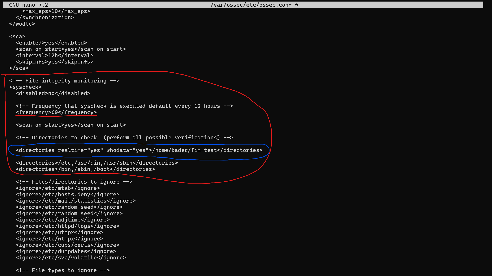

The default config already monitors `/etc`, `/usr/bin`, `/usr/sbin`, `/bin`, `/sbin`, and `/boot` — critical system directories where unauthorized changes would indicate compromise or misconfiguration.

## Testing — Ubuntu Agent

Created, modified, and deleted a test file in the monitored directory:

```bash
echo "sensitive data" > ~/fim-test/secret.txt
echo "modified content" >> ~/fim-test/secret.txt
rm ~/fim-test/secret.txt
```

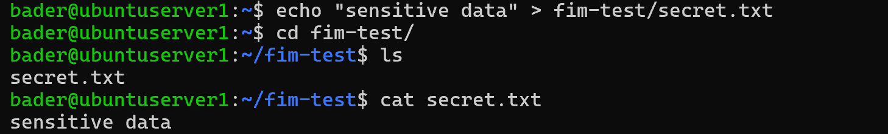
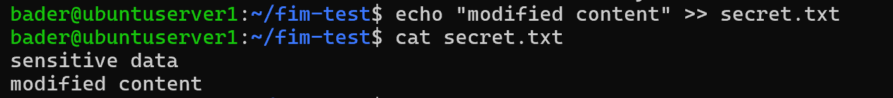
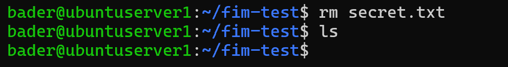

## Detection — Ubuntu Agent

Wazuh caught all three operations. The FIM dashboard shows the events broken down by action type (added, modified, deleted), and the **Top 5 users** table confirms `whodata` is working — user `bader` attributed to all 3 events:

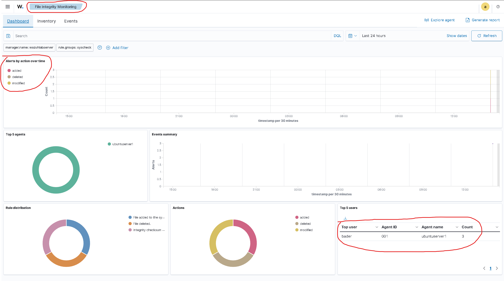

The Events tab shows each event with the file path, event type, and rule IDs:

- **Rule 554** — File added to the system (level 5)
- **Rule 550** — Integrity checksum changed (level 7)
- **Rule 553** — File deleted (level 7)

Modification and deletion trigger at a higher severity than creation — Wazuh treats changes to existing files and deletions as more suspicious than new files appearing.

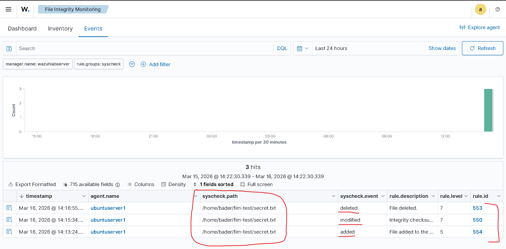

### Alert Deep Dive — Modified File

Expanding the modification alert reveals the forensic detail that makes FIM valuable beyond simple change detection:

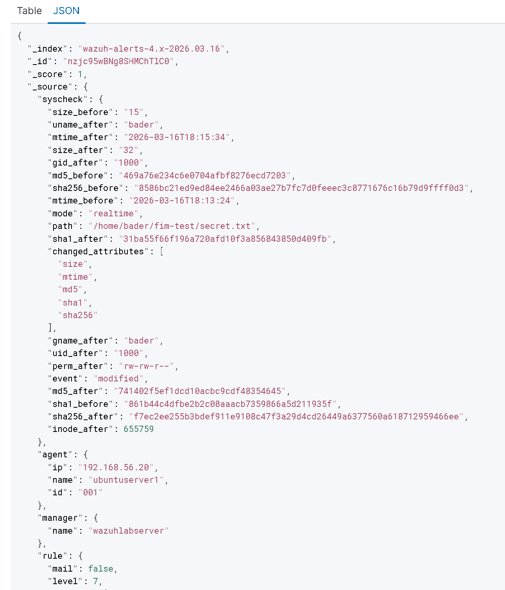

Key fields from the JSON:

- **changed_attributes:** `size`, `mtime`, `md5`, `sha1`, `sha256` — five attributes changed in one modification
- **md5_before / md5_after** and **sha256_before / sha256_after** — full hash comparison proving the file content changed, not just metadata
- **size_before: 15 → size_after: 32** — matches the append operation
- **uname_after: bader** — the user who made the change
- **mode: realtime** — confirms realtime monitoring was active, not a scheduled scan

In an incident, you'd compare these hashes against known-good baselines. This is how FIM provides cryptographic proof of tampering, not just a timestamp change.

## Configuration — Windows Agent

Same approach on the Windows agent. Edited `C:\Program Files (x86)\ossec-agent\ossec.conf`:

- **Frequency** dropped to `60` seconds
- **Custom monitored directory** added with `realtime` enabled

```xml
<directories realtime="yes">C:\fim-test</directories>
```

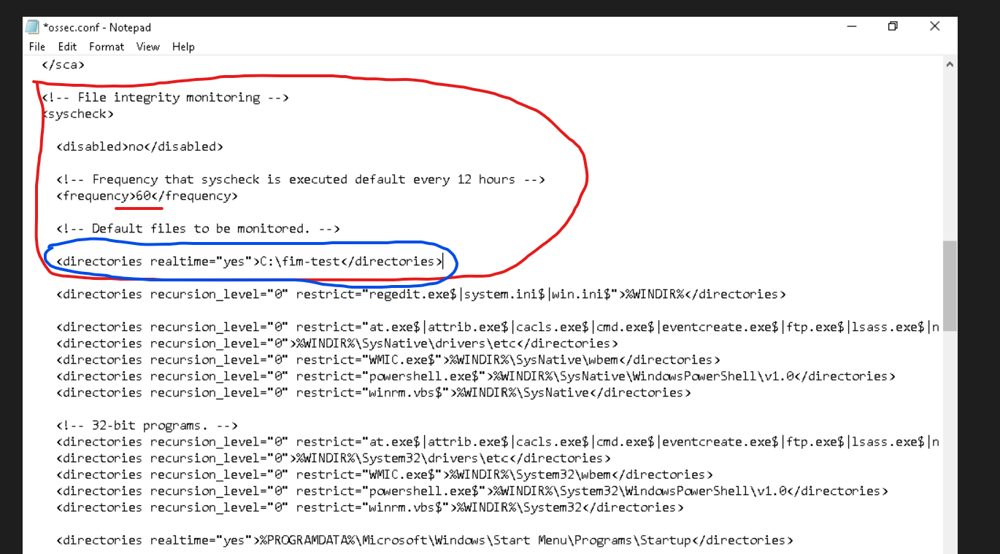

Note: `whodata` was not enabled on Windows for this lab. On Windows, whodata requires enabling object access audit policies in Local Security Policy — additional configuration that wasn't necessary to demonstrate FIM detection. Without it, Wazuh reports ownership group (`Administrators`) instead of the individual user.

The Windows default config is more granular than Ubuntu's — it monitors specific system binaries (`regedit.exe`, `cmd.exe`, `powershell.exe`, `lsass.exe`) in system directories and the Startup folder with realtime enabled. This reflects Windows-specific attack surfaces like persistence through Startup folders or binary replacement.

## Testing — Windows Agent

Same test from PowerShell:

```powershell
echo "sensitive data" > C:\fim-test\secret.txt
echo "modified content" >> C:\fim-test\secret.txt
del C:\fim-test\secret.txt
```

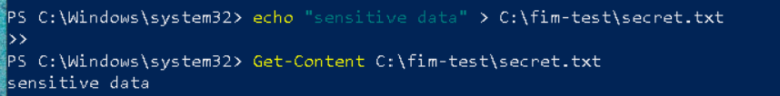
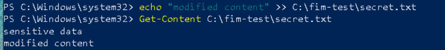
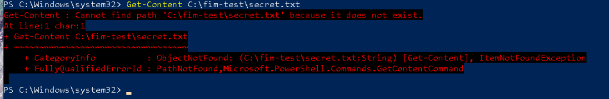

## Detection — Windows Agent

Wazuh detected all three file operations — same rule IDs as Ubuntu (554, 550, 553), demonstrating consistent cross-platform detection logic:

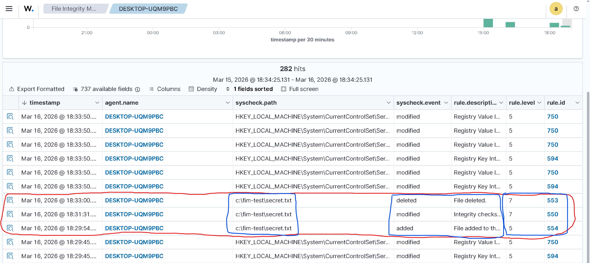

The Events tab also reveals something Ubuntu didn't have: **Windows Registry monitoring noise**. Rules 750 (Registry Value modified) and 594 (Registry Key Integrity changed) fired repeatedly from normal Windows background activity — services updating configs, system processes writing to the registry. This is standard Windows behavior, but in production it highlights the need for tuning `<ignore>` entries and narrowing monitored registry keys to reduce alert fatigue.

### Alert Deep Dive — Modified File (Windows)

The JSON detail for the Windows modification event shows the same forensic structure — hash comparisons, size changes, timestamps — but with `uname_after: "Administrators"` instead of a specific username, confirming the whodata limitation:

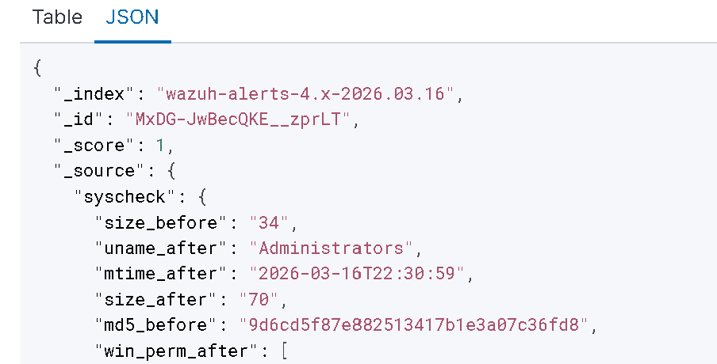

## MITRE ATT&CK Mapping

### Ubuntu Agent

Clean and precise — the numbers map directly to our 3 file operations with no background noise:

- **T1565.001 — Stored Data Manipulation** (2 hits) — file creation and modification
- **T1070.004 — File Deletion** (2 hits) — file deletion
- **T1485 — Data Destruction** (2 hits) — deletion from an impact perspective

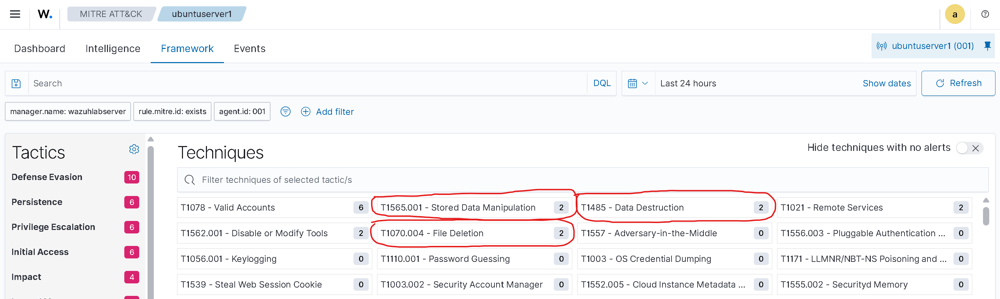

### Windows Agent

Same techniques but with inflated numbers from registry activity — T1112 (Modify Registry) alone has 294 hits from normal Windows background operations:

- **T1565.001 — Stored Data Manipulation** (117 hits)
- **T1070.004 — File Deletion** (89 hits)
- **T1485 — Data Destruction** (89 hits)
- **T1112 — Modify Registry** (294 hits)

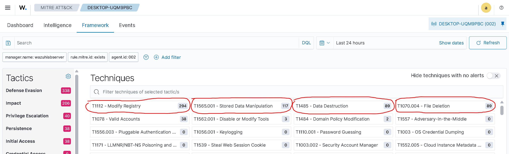

The contrast between Ubuntu's clean MITRE view and Windows' noisy one illustrates a real-world SIEM challenge: Windows generates significantly more baseline telemetry, which requires careful tuning to separate actual threats from normal system activity.

## Ubuntu vs Windows — FIM Comparison

| | Ubuntu | Windows |
|---|---|---|
| Config location | `/var/ossec/etc/ossec.conf` | `C:\Program Files (x86)\ossec-agent\ossec.conf` |
| Whodata support | Built-in (Linux audit subsystem) | Requires audit policy configuration |
| Realtime monitoring | Supported | Supported |
| Default monitoring | System dirs (`/etc`, `/bin`, `/boot`) | System binaries + Registry + Startup folder |
| Registry monitoring | N/A | Yes — built-in, generates significant baseline noise |
| FIM rules triggered | 554, 550, 553 | 554, 550, 553 (same rules, cross-platform) |
| Background noise | Minimal | High (registry activity) |

Both platforms detected through a single Wazuh manager using the same syscheck rules — consistent, centralized file integrity monitoring across operating systems.

## Configuration Note — Local vs Centralized

This lab configured each agent locally by editing `ossec.conf` directly on the endpoint. In production with dozens or hundreds of agents, the better approach is **centralized management** — pushing FIM configs from the Wazuh manager via `agent.conf` in `/var/ossec/etc/shared/`. One config change propagates to all agents in a group. Local configuration was used here for simplicity and to show exactly what's happening on each machine.
