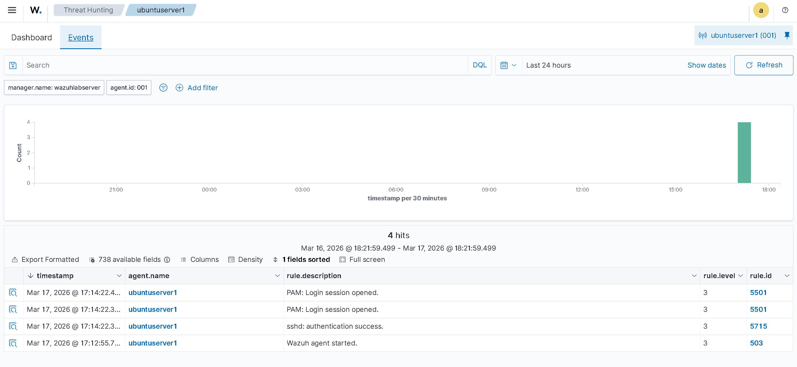
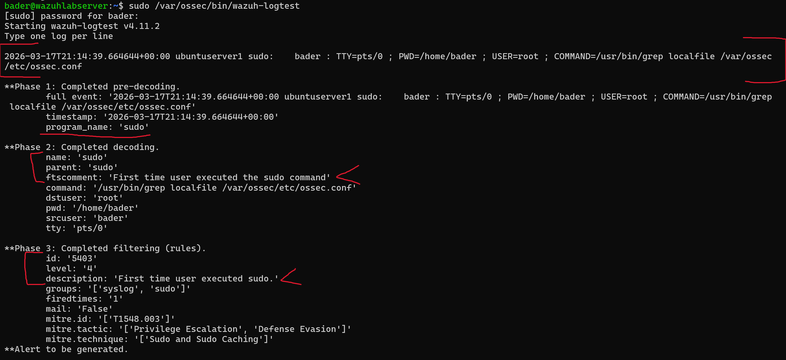
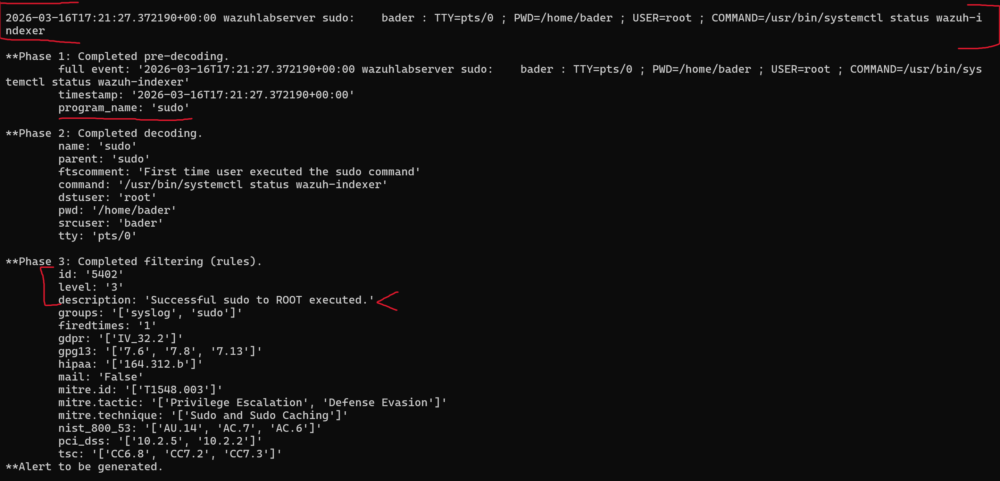
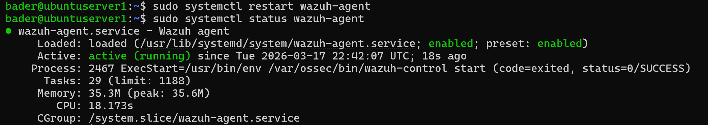
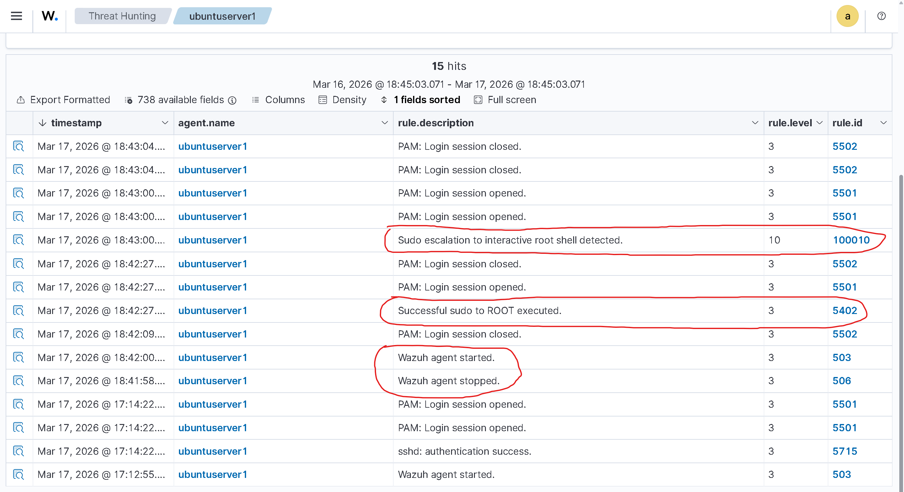

# Troubleshooting: Custom Rules Not Firing

## Problem

After adding custom rules 100010 and 100011 to `local_rules.xml` and restarting the Wazuh manager, running `sudo su` on the Ubuntu agent produced no alerts. The dashboard showed only PAM session events (5501) and sshd authentication success (5715) — no rule 5402 and no custom rule 100010:



The rules were confirmed loaded in the Wazuh dashboard under Management → Rules — both [100010](screenshots/found-the-added-local-rule-100010-in-wazuh-dashboard-with-matching-description.png) and [100011](screenshots/found-the-added-local-rule-100011-in-wazuh-dashboard-with-matching-description.png) appeared with correct descriptions, levels, and groups. The rules existed but weren't evaluating.

## Diagnosis

Used `wazuh-logtest` on the Wazuh server to test the detection pipeline directly. Pasted an actual sudo log line from the Ubuntu agent's `/var/log/auth.log`:

First test matched rule **5403** (First time user executed sudo) instead of 5402, because logtest treats each session as fresh with no prior state:



Second test within the same logtest session matched rule **5402** (Successful sudo to ROOT executed) — confirming the decoder works and the rule chain is valid:



This proved the rules and decoders were correct. The issue was not with the detection logic.

## Root Cause

Only the Wazuh **manager** was restarted after adding the custom rules. The Wazuh **agent** on the Ubuntu machine was not restarted. The agent needs to be restarted to re-establish its connection and ensure logs are flowing through the updated rule engine properly.

## Fix

Restarted the Wazuh agent on the Ubuntu machine:

```bash
sudo systemctl restart wazuh-agent
```



The dashboard showed the agent being stopped and starting again and after running `sudo su` again — The dashboard immediately showed both rule 5402 and custom rule 100010 firing in sequence:



## Lesson

After adding or modifying custom rules on the Wazuh manager, restart **both** the manager and the agent. The manager needs the restart to load the new rules, and the agent needs it to re-sync with the updated rule engine.
