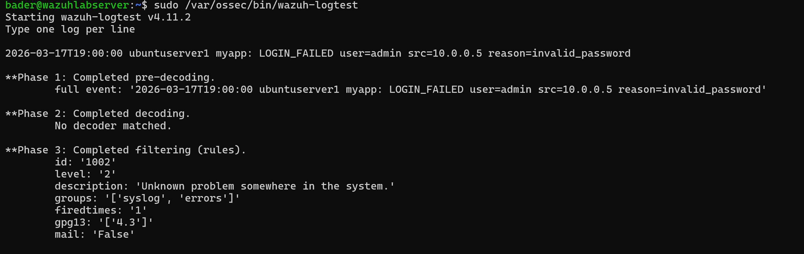
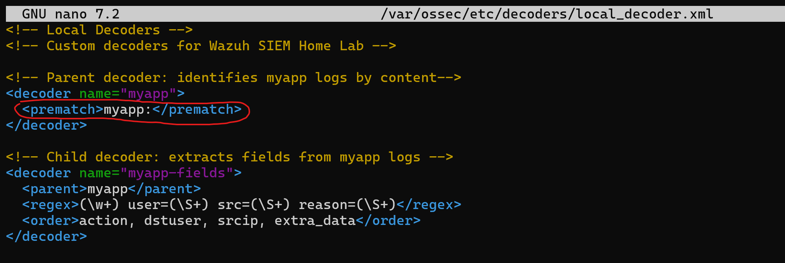

# Troubleshooting: Custom Decoder Not Matching

## Problem

After writing a custom decoder for the `myapp` log source, `wazuh-logtest` showed "No decoder matched" in Phase 2. The log line was ingested but Wazuh couldn't parse it, so it fell through to the generic rule 1002 ("Unknown problem somewhere in the system"):



## Root Cause

The original decoder used `<program_name>myapp</program_name>` to identify logs:

```xml
<decoder name="myapp">
  <program_name>myapp</program_name>
</decoder>
```

This relies on Wazuh's pre-decoder extracting `myapp` as the program name from the syslog header. Standard syslog format (`Mar 17 19:00:00 host myapp: message`) would work, but our log used ISO 8601 timestamps (`2026-03-17T19:00:00`). The pre-decoder couldn't parse this timestamp format correctly, so it never identified `myapp` as the program name.

## Fix

Changed the parent decoder to use `<prematch>` instead of `<program_name>`. This matches on the log content directly rather than depending on the pre-decoder's syslog header parsing:

```xml
<decoder name="myapp">
  <prematch>myapp:</prematch>
</decoder>
```



After restarting the Wazuh manager, `wazuh-logtest` confirmed the decoder matched and all fields were extracted correctly — leading to rule 100021 firing as expected.


## Lesson

When writing custom decoders, `<program_name>` only works if the log follows standard syslog format that Wazuh's pre-decoder can parse. For non-standard log formats or logs with ISO timestamps, use `<prematch>` to match on content instead. This is more reliable and works regardless of the timestamp format.
